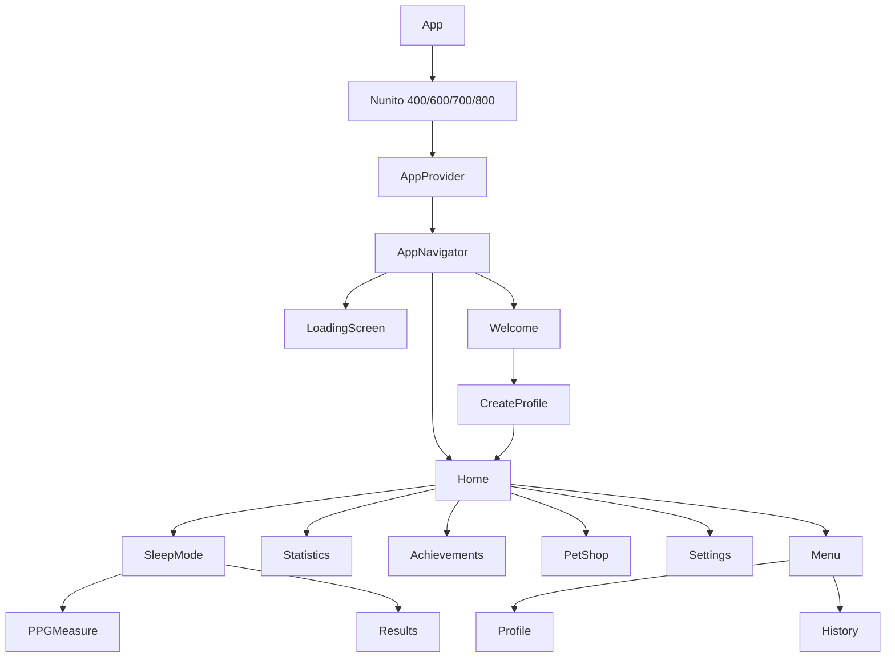
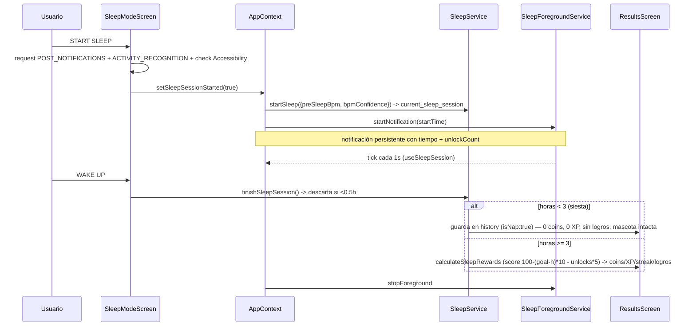
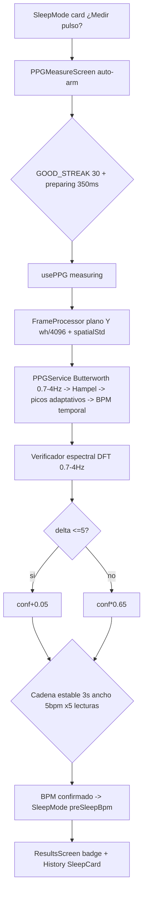

# SleepPet — Arquitectura

> Fuente operativa: `AGENTS.md` (constraints críticos: New Arch ON, sync nativo, builds).  
> Este documento describe el funcionamiento actual de la app. `AGENTS.md` se deja intacto.

## 1. Stack & Overview

- **Expo SDK 54 / React Native 0.81.5 / New Architecture ON** (`newArchEnabled:true` en `app.json` y `android/gradle.properties`)
- **Hermes**, **AsyncStorage**, **React Navigation (native-stack)**
- **Cámara PPG:** `react-native-vision-camera 4.7.3` + `react-native-reanimated 4.1.7` + `react-native-worklets 0.5.2` + `react-native-worklets-core 1.6.3`
- **UI:** `expo-linear-gradient`, `@expo-google-fonts/nunito`, `@expo/vector-icons`, `expo-constants`
- **Solo Android** (`foregroundServiceType="specialUse"`). `minSdk 26` (requerido por `frame.toArrayBuffer()`).

## 2. Estructura del proyecto

```
App.js
navigation/AppNavigator.js
context/AppContext.js
screens/*.js + screens/styles/*.styles.js
components/*.js          # primitivas de diseño
services/*.js            # lógica de dominio
storage/*.js             # AsyncStorage wrappers
hooks/usePPG.js, hooks/useSleepSession.js
constants/theme.js, constants/tabs.js, constants/PetImages.js
translations/es.js, translations/en.js
plugins/native/java/com/gathod/SleepPet/  # source of truth nativo
plugins/withSleepPetNative.js             # copia a android/ en prebuild
android/                                  # generado por expo prebuild / compilado por Gradle
assets/pets/<id>/{happy,normal,sleepy,sad}.png
tools/testPPG.js
```

## 3. Bootstrap & Navegación



- `App.js:14` carga fuentes con `useFonts`; mientras tanto `LoadingScreen`.
- `AppProvider` envuelve `AppNavigator`.
- `AppNavigator.js:60` single `createNativeStackNavigator` con `headerShown:false`; ruta inicial `userName ? "Home" : "Welcome"`; 15 screens + `AchievementPopup` global overlay.
- `SwipeableTabScreen` + `constants/tabs.js:TAB_ORDER` permite swipe horizontal entre las 5 tabs del `BottomNav`.

## 4. Estado global — `context/AppContext.js`

Single source of truth. Carga en `loadData()` y guarda automático en `saveAppData()`.

| Dominio | Keys en AppContext | Persistencia |
|---|---|---|
| Perfil | `userName`, `petNames{m}`, `userAge`, `goalHours`, `goalType`, `selectedPet`, `ownedPets`, `language` | `sleep_pet_data` |
| Economía | `coins` | `sleep_pet_data` |
| Nivel | `level`, `xp` (100 XP/nivel) | `sleep_pet_data` |
| Mascota | `petMood`, `petHappiness`, `lastHappinessUpdate` | `sleep_pet_data` |
| Racha | `streak`, `lastStreakDateKey` | `sleep_pet_data` |
| Historial | `sleepHistory[]`, `lastSleepSession`, `lastSleepHours` | `sleep_history` |
| Sesión | `sleepSessionStarted`, `unlockCount`, `unlockTimes`, `preSleepBpm`, `bpmConfidence` | `current_sleep_session` + `sleep_pet_data` |
| Logros | `unlockedAchievements`, `achievementPopup` | `sleep_pet_achievements` |

Efectos en `AppContext`:
- Hidratación + restart de sesión activa (`startNotification` + `setSleepActive(true)`) + `decayPetHappiness` hasta `startTime` si hay sesión.
- Re-schedule del recordatorio en cada cambio de `language`.
- Listener de desbloqueos (`startAccessibilityListener`) que solo incrementa si `sleepSessionStarted`.
- `updateUnlockState` / `updateUnlocks` en cada cambio de `unlockCount`.

## 5. Storage — AsyncStorage

| Key | Contenido | Storage |
|---|---|---|
| `sleep_pet_data` | perfil+economía+petMood+level+xp+language+`preSleepBpm`/`bpmConfidence` | `AppStorage.js` |
| `current_sleep_session` | `{startTime, active, unlockCount, unlockTimes, preSleepBpm, bpmConfidence, bpmCapturedAt, bpmSource}` | `CurrentSleepStorage.js` |
| `sleep_history` | array de sesiones finalizadas (cada una con bpm si hubo) | `SleepStorage.js` |
| `sleep_pet_achievements` | ids desbloqueados | `AchievementStorage.js` |
| `sleep_reminder_settings` | `{enabled, hour, minute}` | `ReminderStorage.js` |
| SharedPrefs `sleep_reminder` | `sleepActive`, `followupCount/Max`, `followupTitle/Content` | nativo `ReminderModule` |
| SharedPrefs `sleep_movement` | `{events, lastEpochIdx, score, epochs[]}` del detector nativo | nativo `SleepForegroundService` |

Racha: `StreakService.computeStreakUpdate` (`STREAK_MIN_HOURS=3`, 1×/día, siestas <3h neutras).

## 6. Flujos core

### 6.1 Sesión de sueño



### 6.2 Detección de desbloqueos

```mermaid
graph LR
  A[UnlockAccessibilityService] -->|SCREEN_OFF arma| B
  B -->|USER_PRESENT: resolver foreground a los 800ms| C{rootInActiveWindow}
  C -->|SleepPet| X[no cuenta: filtro]
  C -->|launcher / otra app / ""| D[AccessibilityModule.checkForegroundApp]
  B -->|WINDOW_STATE_CHANGED app real sin keyguard| D
  D -->|PHONE_UNLOCKED| E[AccessibilityListener.js]
  E -->|solo si sleepSessionStarted| F[unlockCount++ / unlockTimes[]]
  F --> G[SleepService.updateUnlockState]
  F --> H[NotificationService.updateUnlocks]
```

- Decisión única por desbloqueo: `USER_PRESENT` difiere 800ms (`FOREGROUND_CHECK_DELAY_MS`) para que la app de destino tenga su ventana activa; si quedó en SleepPet no cuenta (antes se pasaba `""` y contaba todo). El armado se consume al resolver → navegaciones posteriores con pantalla encendida no cuentan. Debounce 2s + handler limpiado en `onUnbind`/`onDestroy`.

### 6.3 Fotopletismografía PPG



- Gates: `FINGER_MIN 80`, `SPATIAL_STD_MAX 18` (textura intra-frame), `BAD_STREAK 15`/`GOOD_STREAK 30`, `PULSATILE_MIN_STD 1.0` (`filteredStd<1 && conf<0.60 -> low_pulsatile`).
- Validado con `tools/testPPG.js` señal sintética 30Hz (11/13 OK, `delta espectral 0.0-0.1`).

### 6.4 Recordatorio para dormir

`SettingsScreen` guarda `{enabled,hour,minute}` → `ReminderService.scheduleReminder` → `ReminderModule.schedule` (`AlarmManager.setAlarmClock` si `canScheduleExactAlarms()`, fallback `setInexactRepeating`) → `ReminderReceiver` muestra notificación y re-agenda; followups cada 15min ×4 con `sleepActive` gate. Sin `BOOT_COMPLETED` — se pierde al reiniciar hasta reabrir app.

### 6.5 Economía & Mascotas

- `PET_IMAGES` auto-detectadas vía `require.context` en `assets/pets/`; añadir mascota = subir carpeta con 4 moods.
- `PetService.PETS` deriva `available` de `AVAILABLE_PETS`.
- `PetHappinessService`: `calculatePetHappiness` (+10/6/2/-12) + `decayPetHappiness` (1/h tras 6h gracia).

### 6.6 Movimiento nocturno (acelerómetro)

```mermaid
graph TD
  A[START SLEEP -> startNotification resume=false] --> B[SleepForegroundService]
  B --> C[SensorManager TYPE_ACCELEROMETER SENSOR_DELAY_NORMAL]
  C --> D[MovementDetector |mag-g| m/s²]
  D --> E[Eventos: histéresis 0.60/0.30 + quiet 3s + dur mín 2s + cooldown 5s]
  D --> F[Epochs 5min anclados a startTime + score = exceso/piso 0.15]
  E & F --> G[SharedPreferences sleep_movement]
  G -->|getMovementSummary| H[MovementService.js]
  H --> I[SleepMode card poll 30s]
  H --> J[finishSleep: merge a session -> sleep_history + clear]
  B -->|resume=true AppContext restore| J2[carga prefs y continúa]
```

- **Fuente única:** el detector vive en `SleepForegroundService.kt` (clase interna `MovementDetector`); sin segundo servicio ni listener `expo-sensors` en JS. Funciona con pantalla apagada.
- **Señal:** `|sqrt(x²+y²+z²) − STANDARD_GRAVITY|` en m/s², independiente de orientación; dt vía timestamps del sensor (ns, monótono); máquina de eventos sobre `SystemClock.elapsedRealtime()`.
- **Métricas:** `movementEvents` (total), `movementScore` (promedio ponderado del exceso sobre piso 0.15 m/s² — medida interna de actividad, **no clínica**), `movementEpochs[]` = `{startTime, durationMs, movementScore, movementEvents}` cap 160 (~13h).
- **Persistencia nativa:** SharedPreferences `sleep_movement` (`{events, lastEpochIdx, score, epochs[]}`) escrita al cerrar cada epoch y en flush terminal (`onDestroy`/stop); sobrevive muerte del proceso. `snapshot()` para JS **no muta estado** (el poll de 30s no fragmenta epochs).
- **Resume:** `EXTRA_RESUME` en el intent — sesión nueva limpia prefs y arranca de cero; restore de `AppContext.loadData` pasa `resume=true`, el detector recarga prefs y continúa (el epoch parcial en curso al morir el proceso se pierde: <5 min documentado). Restart STICKY con `intent==null` no registra sensor (igual que hoy; la restauración real la hace JS al reabrir la app).
- **JS:** `services/MovementService.js` (guard + fallback `{events:0,score:0,epochs:[]}` + `movementLevel(score,t)` solo presentación). `finishSleep` lee resumen tras `stopNotification`, lo adjunta a la sesión de `sleep_history` (`movementEvents/movementScore/movementEpochs`) y **limpia siempre** (también si la sesión <0.5h se descarta). Sesiones antiguas sin estos campos siguen funcionando (`?? 0/[]/null` en UI).
- **UI:** card glass "Movimiento nocturno · N eventos" en SleepMode (poll 30s), metricCard condicional en Results (`12 eventos · Bajo/Medio/Alto`), icono `movement` (MCI walk). Statistics queda con datos listos para gráfica en fase 2. SleepCard sin cambios.

## 7. Capa nativa

- **Módulos legacy** registrados en `MainApplication.getPackages()`: `AccessibilityModule`, `NotificationModule`, `ReminderModule` (requieren New Arch ON).
- **Dos copias:** `plugins/native/...` es source of truth; `withSleepPetNative.js` copia a `android/app/src/main/java/...` en `expo prebuild`; Gradle compila las copias de `android/`.
- **Foreground:** `SleepForegroundService` con `specialUse` (no `health`).
- **Permisos:** `CAMERA` via `expo-build-properties` + `withSleepPetNative` + `AndroidManifest.xml` manual.

## 8. Sistema de diseño

- **Tema nocturno** `constants/theme.js:NIGHT` (`#1B1B4B`→`#5E60CE`, lavandas, amarillo `#FFD166`, rosa `#FF8FAB`), fuente `Nunito` vía `theme.FONT_FAMILY`, primitivas `NightBackground`/`GlowMoon`/`Card`/`AppText`/`AppIcon`/`BottomNav`/`ProgressBar`/`SectionHeader`/`MotivationalCard`.
- **Patrones:** `NIGHT_STYLES` en `theme.js` + `screens/styles/*.styles.js` (sin `StyleSheet.create` inline).
- Pantallas de referencia: `HomeScreen` (header+mascota+streak/nivel+LAST NIGHT), `SleepModeScreen` (GlowMoon + unlocks + glass cards), `PPGMeasureScreen` (círculo 130px + anillo estado + corazón 60000/liveBpm + sparkline + barra estabilidad).

## 9. Traducciones, Build & Debug

- `translations/{es,en}.js` vía `TranslationService.getTranslations(language)`.
- **Build:** `cd android && gradlew assembleRelease` → `app-release.apk` (debug-signed); `adb install -r ...`; `org.gradle.jvmargs=-Xmx4096m`; bump `versionCode` en `app.json` y `android/app/build.gradle`.
- **Debug:** `npx expo run:android` (Metro); release usa bundle Hermes embebido.
- **adb** en `C:\Android\Sdk\platform-tools\adb.exe`; tags logcat `UnlockA11y`, `ReactNativeJS` (`PPG frame avg=... spatialStd=...`, `PPG: live BPM ... filteredStd ... spectralBpm ...`), `Frame`.

## 10. Convenciones

- Comentarios y logs en español.
- Tunables PPG arriba de cada archivo (`FINGER_MIN`, `SPATIAL_STD_MAX`, `EXPOSURE_BIAS`, `HAMPEL_K`, `PULSATILE_MIN_STD`, `SPECTRAL_*`).
- Ver `AGENTS.md` para constraints críticos que no se repiten aquí (New Arch, sync nativo, OOM, gotchas VisionCamera `useCameraDevice("back")` + lazy `frameProcessor` + `toArrayBuffer` minSdk 26).
