# SleepPet

App Android de sueño gamificada: registra tu descanso, mide señales con el teléfono y cuida una mascota que reacciona a cómo duermes.

Versión actual: **1.3.2** (versionCode 13).

## Qué hace

- **Sesión de sueño**: cronómetro persistente en una notificación (foreground service) con conteo de desbloqueos del teléfono vía servicio de accesibilidad.
- **Smart Sleep**: detecta movimiento con el acelerómetro y actividad sonora con el micrófono (solo RMS/ZCR, el audio nunca se guarda) para clasificar cada ventana de 30s en despierto / ligero / profundo, sin machine learning.
- **Pulso pre-sueño (PPG)**: mide tu frecuencia cardíaca con la cámara y el flash antes de dormir, con filtrado Butterworth + Hampel + verificación espectral. Los frames se procesan en memoria y se descartan; no se guarda video.
- **SmartAlarm**: alarma con ventana favorable — si detecta sueño ligero con confianza suficiente dentro de la ventana, adelanta el despertar; si no, suena a la hora objetivo.
- **Recordatorio para dormir**: hora configurable con hasta 4 recordatorios de seguimiento cada 15 min si sigues despierto.
- **Gamificación**: monedas, XP y niveles, racha diaria, logros, y mascotas comprables (gato, perro, dragón, panda) con felicidad que sube o baja según tu sueño.
- **Daily Check-in**: registro opcional de energía y experiencia de estudio para ver patrones descriptivos (sin causalidad).
- **Idiomas**: español e inglés.

## Privacidad

Todo el procesamiento es **local en el dispositivo**: la app no hace ninguna llamada de red ni envía datos a servidores. El audio nocturno se convierte en métricas y se descarta; los frames de cámara del PPG se procesan en memoria y se descartan. Los datos se guardan en AsyncStorage / SharedPreferences del teléfono.

Esta app es una herramienta de bienestar, **no un dispositivo médico**: las métricas de sueño, movimiento y pulso son estimaciones no clínicas.

## Stack

- Expo SDK 54 / React Native 0.81.5 con **New Architecture** y Hermes
- React Navigation (native-stack), AsyncStorage
- Módulos nativos Kotlin (accesibilidad, notificaciones, alarma, movimiento) — ver `AGENTS.md`
- `react-native-vision-camera` 4.7.3 + Reanimated 4 + Worklets para el frame processor del PPG
- Diseño nocturno propio: `expo-linear-gradient`, Nunito, `@expo/vector-icons`

El detalle de flujos, storage y capa nativa está en [`ARCHITECTURE.md`](ARCHITECTURE.md). Los constraints críticos de desarrollo están en [`AGENTS.md`](AGENTS.md).

## Requisitos

- Android 8.1 o superior (minSdk 26)
- Node.js
- JDK 17
- Android SDK (platform-tools para `adb`)

## Compilar e instalar

```bash
npm install

cd android
gradlew assembleRelease
```

El APK queda en `android/app/build/outputs/apk/release/app-release.apk` (firmado con debug keystore, no apto para Play Store). Para instalarlo:

```bash
adb install -r app\build\outputs\apk\release\app-release.apk
```

Para desarrollo con hot reload (Metro):

```bash
npx expo run:android
```

Nota: si editas código nativo (`.kt`) debes mantener sincronizadas las dos copias (`plugins/native/` y `android/`) — ver `AGENTS.md`.

## Permisos y para qué se usan

| Permiso | Uso |
|---|---|
| Accesibilidad | Contar desbloqueos del teléfono durante la sesión (se resuelve el foreground y SleepPet se filtra) |
| Notificaciones | Cronómetro de sesión, recordatorio y alarma |
| Actividad física (`ACTIVITY_RECOGNITION`) | Detección de movimiento con el acelerómetro |
| Micrófono (`RECORD_AUDIO`) | Solo RMS/ZCR por ventana; el audio se descarta tras extraer métricas |
| Cámara (`CAMERA`) | Medición PPG de pulso con flash; frames descartados tras el filtrado |
| Alarmas exactas (`SCHEDULE_EXACT_ALARM`) | Recordatorio y SmartAlarm puntuales (Android 14+ requiere activarlo en Ajustes) |

## Tests

Harnesses puros de Node (sin frameworks):

```bash
node tools/testUserData.js       # detección de usuario existente (15/15)
node tools/testPPGStability.js   # cadena de estabilidad del pulso (4/4)
node tools/testPPG.js            # algoritmo PPG con señal sintética (13/13)
node tools/testPPGDiagnostics.js # diagnóstico sombra PPG (6/6)
node tools/testCheckIn.js        # lógica de check-in diario (29/29)
node tools/testShop.js           # tienda (TODO OK)
node tools/testWakeBackfill.js   # backfill WAKE del historial (10/10)
node tools/testPetHappiness.js   # felicidad y mood de la mascota (12/12)
node tools/testPetAlert.js       # alerta de mascota triste (6/6)
```

## Capturas

Recorrido completo en español (build 1.3.0; faltan Home, Achievements, Results y Editar perfil):

| | | |
|---|---|---|
| 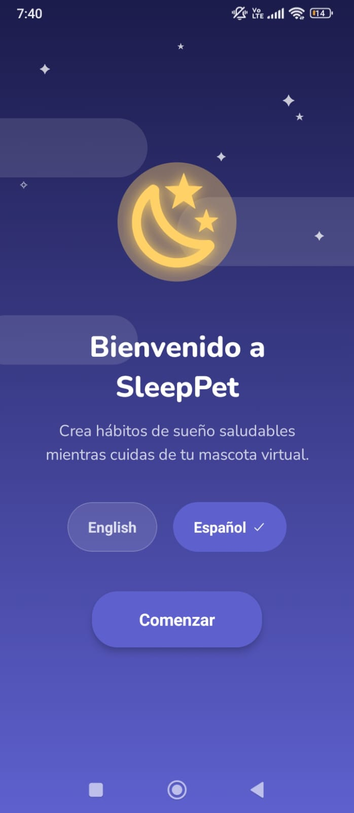 **Bienvenida** — idioma y comienzo | 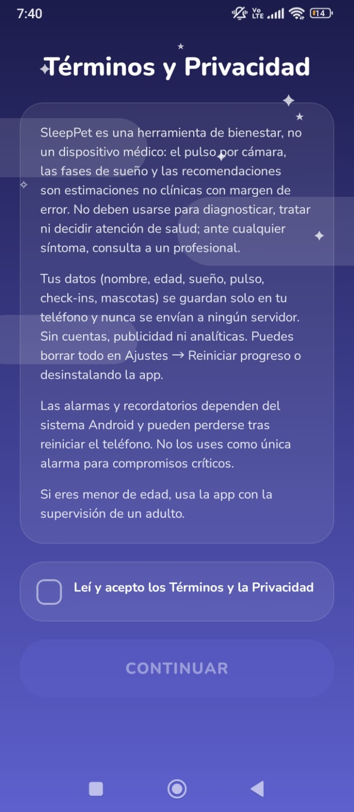 **Términos** — checkbox obligatorio | 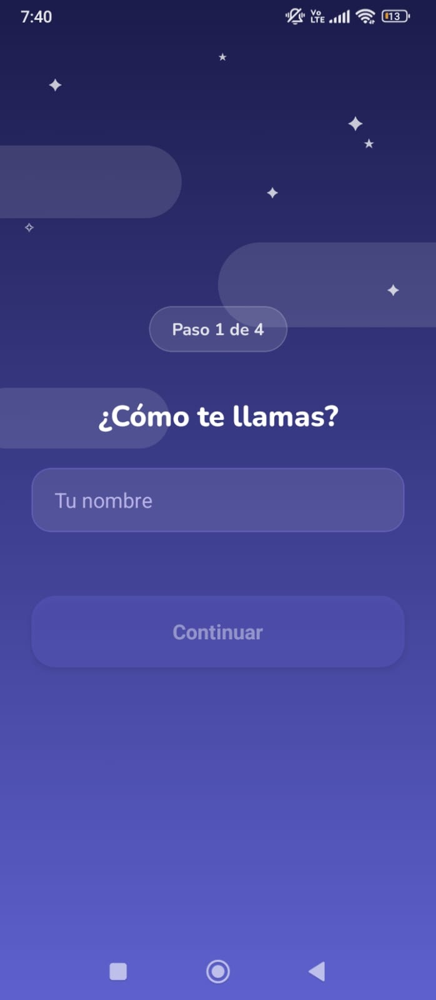 **Perfil 1/4** — tu nombre |
| 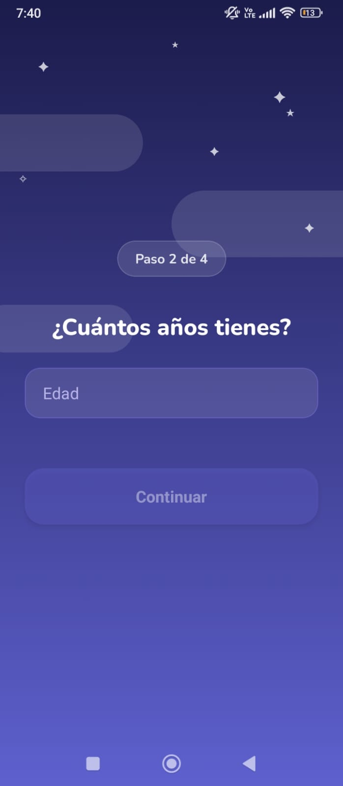 **Perfil 2/4** — tu edad | 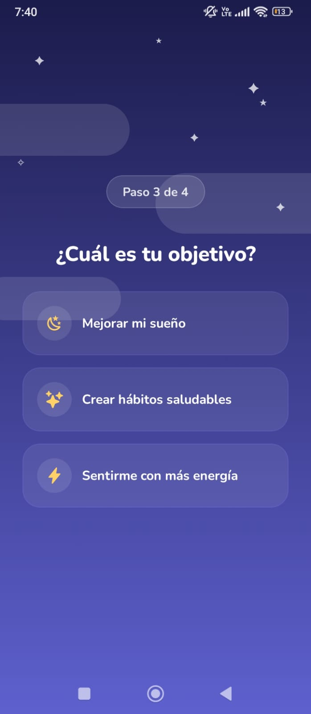 **Perfil 3/4** — tu objetivo | 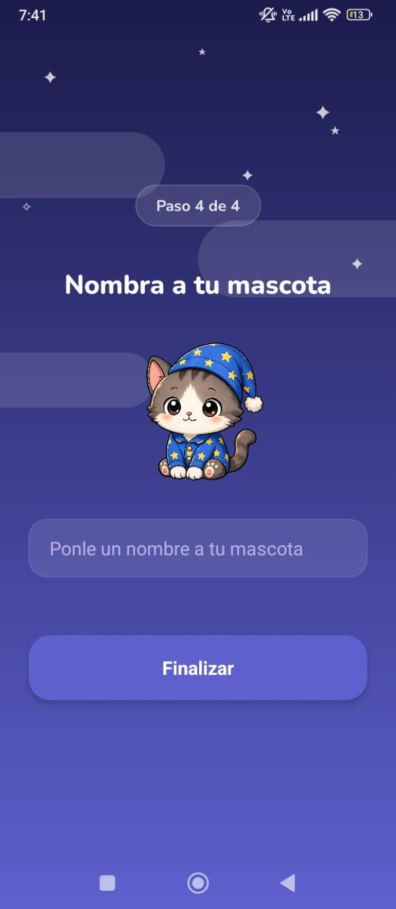 **Perfil 4/4** — nombra a tu mascota |
| 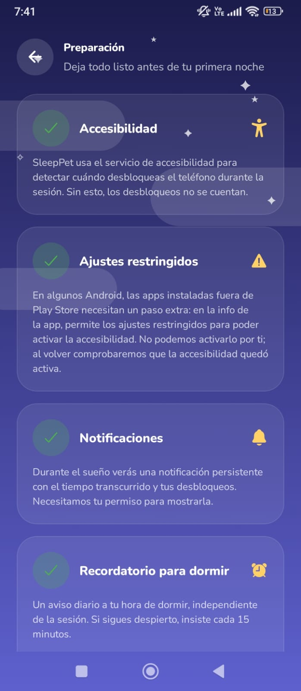 **Preparación** — accesibilidad y permisos | 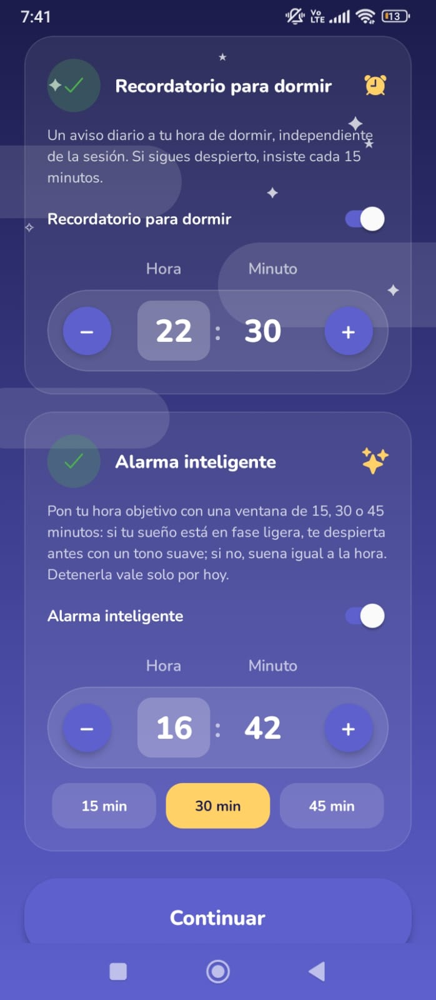 **Ajustes** — recordatorio 22:30 y SmartAlarm | 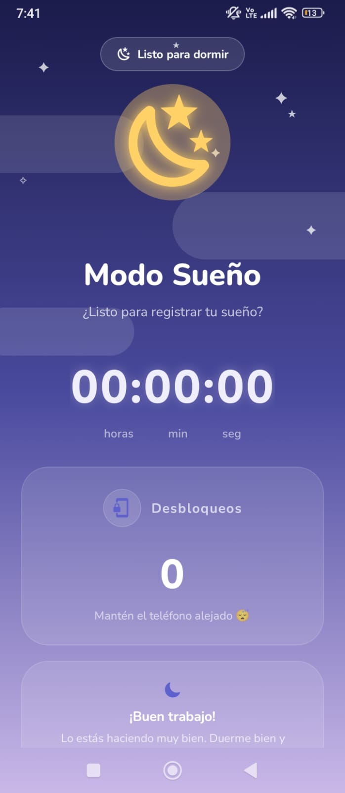 **Modo Sueño** — listo para registrar |
| 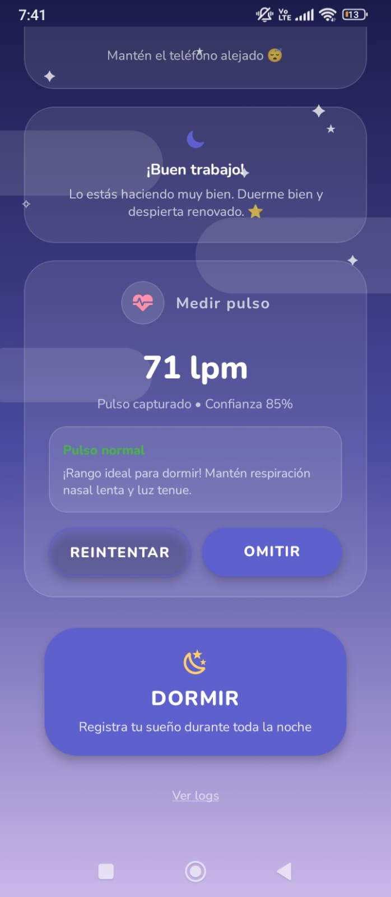 **Pulso** — 71 lpm, confianza 85% | 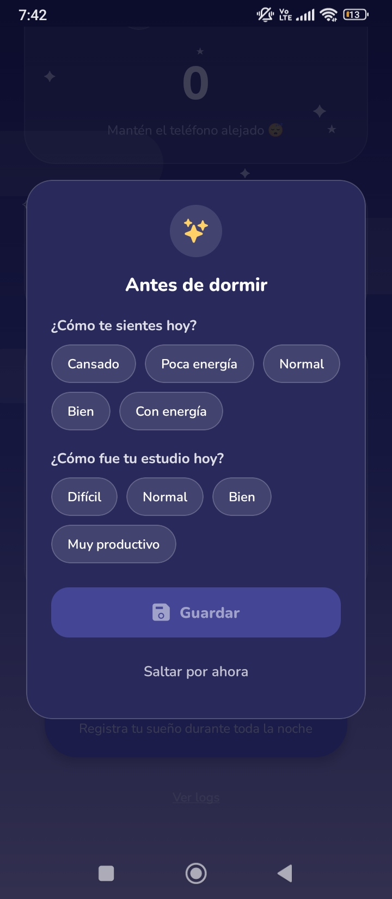 **Check-in** — energía y estudio del día | 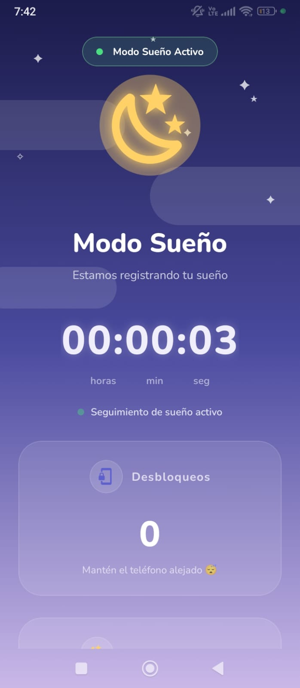 **Sesión activa** — cronómetro y desbloqueos |
| 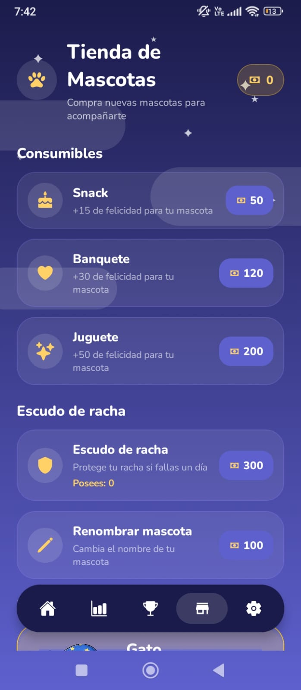 **Tienda** — snacks y felicidad | 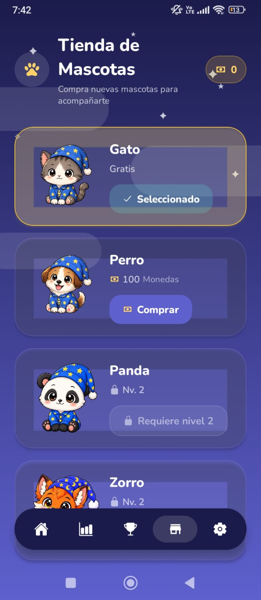 **Tienda** — Gato, Perro, Panda, Zorro | 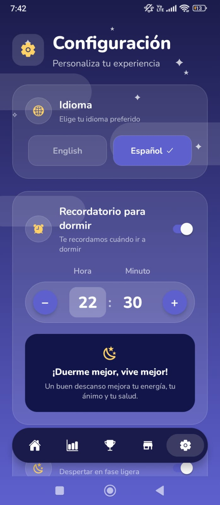 **Ajustes** — idioma y recordatorio |
| 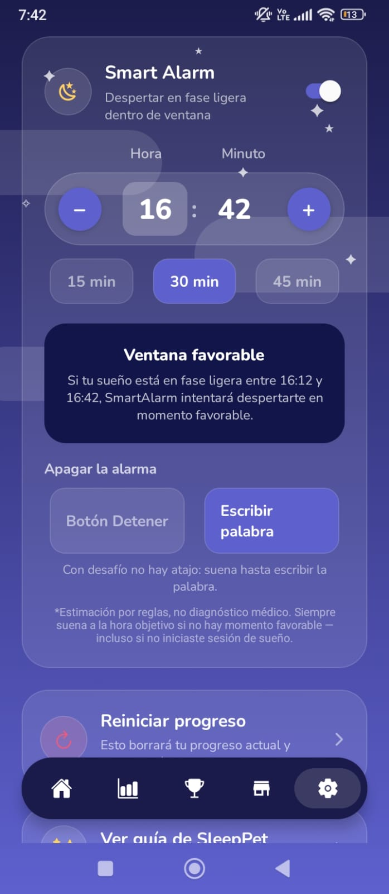 **SmartAlarm** — desafío "escribir palabra" | 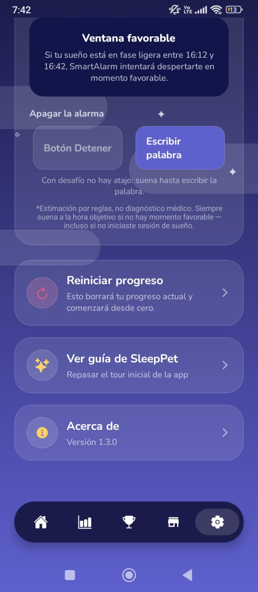 **Ajustes** — reiniciar, guía, acerca de | 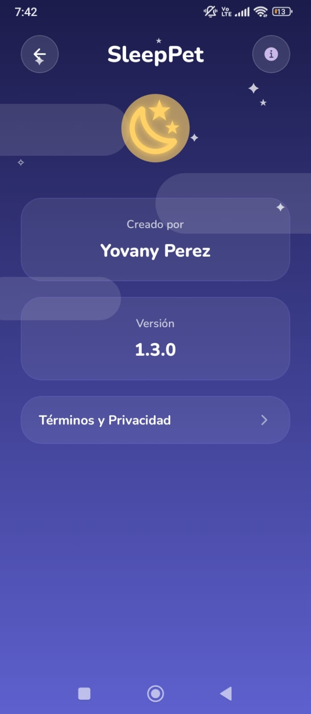 **Acerca de** — versión y términos |
| 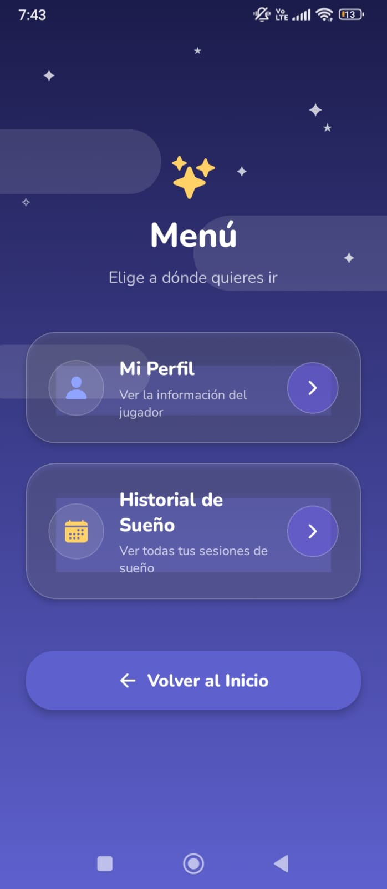 **Menú** — perfil e historial | 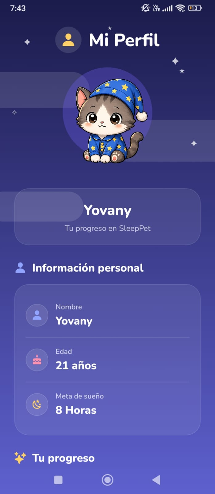 **Perfil** — datos personales | 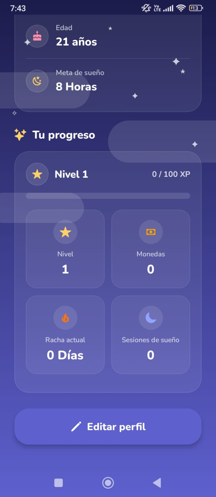 **Perfil** — nivel y racha |
| 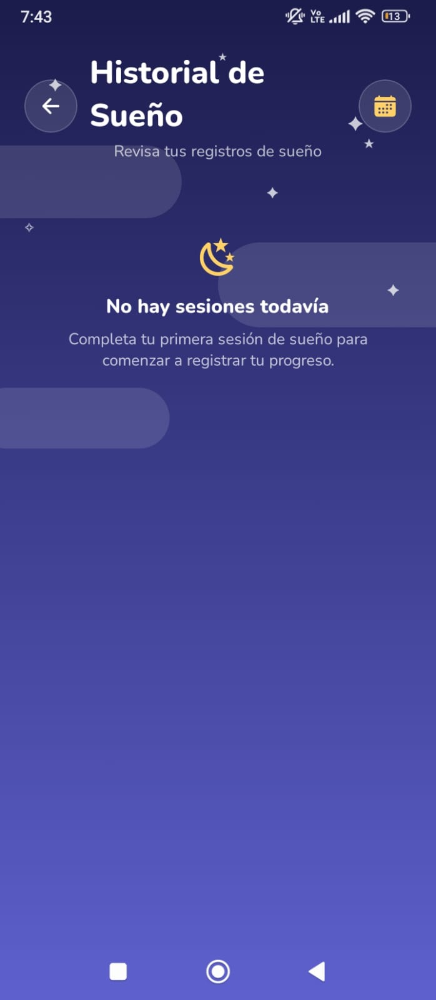 **Historial** — vacío inicial | 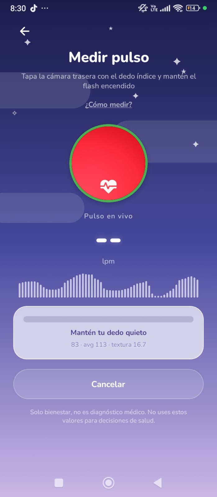 **PPG** — medición en vivo con flash | |
